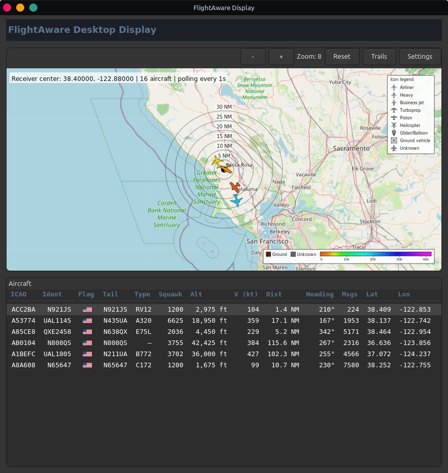

# FlightAware Desktop Display

A native GTK4 desktop app that polls a local FlightAware/PiAware receiver's
`aircraft.json` and `receiver.json` and displays live traffic on a sortable
table and an OpenStreetMap-tiled map, matching the receiver's own SkyAware
coloring and iconography.



## Running from source

Requires Python 3 and the GTK4 PyGObject bindings as system packages (not
pip-installable).

### Linux

```
sudo apt install python3-gi python3-gi-cairo gir1.2-gtk-4.0
python3 main.py
```

### macOS

Requires [Homebrew](https://brew.sh):

```
brew install gtk4 pygobject3 adwaita-icon-theme
python3 main.py
```

This uses Homebrew's own `python3`, which `pygobject3` builds against; a
separately installed Python (pyenv, python.org, etc.), or even macOS's
built-in system `python3` at `/usr/bin/python3`, generally won't see the
`gi` or `cairo` modules and will fail with `ModuleNotFoundError`. Confirm
Homebrew's `python3` is the one actually being used:

```
which python3   # should print /opt/homebrew/bin/python3 (Apple Silicon)
                 # or /usr/local/bin/python3 (Intel)
```

If it prints `/usr/bin/python3` instead, Homebrew's `shellenv` isn't taking
effect in your shell. It usually lives in `~/.zprofile`, which only runs for
login shells; if your terminal opens non-login shells, add the same line to
`~/.zshrc`. Also try opening a new terminal window or running `hash -r`,
since an already-open shell can have `python3` cached to the old path.
Dark/light mode follows the macOS appearance setting via a
lightweight poll of `defaults read -g AppleInterfaceStyle` (there's no
`xdg-desktop-portal` on macOS, which is what Linux uses for the same
purpose).

Settings are stored at `$XDG_CONFIG_HOME/fa_display/settings.json` (normally
`~/.config/fa_display/settings.json`); the map tile cache and any
non-bundled flag downloads are cached under
`$XDG_CACHE_HOME/fa_display/` (normally `~/.cache/fa_display/`). GLib
resolves these to the same `~/.config`/`~/.cache` paths on macOS as on
Linux.

## Building the Flatpak

Flatpak is Linux-only; on macOS, run from source as above.

Requires `flatpak-builder` and the `org.gnome.Sdk`/`org.gnome.Platform`
runtime (version `49`, matching `net.airwisp.FaDisplay.yml`):

```
sudo apt install flatpak-builder
flatpak install flathub org.gnome.Sdk//49 org.gnome.Platform//49
```

Build and install locally:

```
flatpak-builder --user --install --force-clean builddir net.airwisp.FaDisplay.yml
```

Run it:

```
flatpak run net.airwisp.FaDisplay
```

Rebuild after making changes by re-running the `flatpak-builder` command
above.
